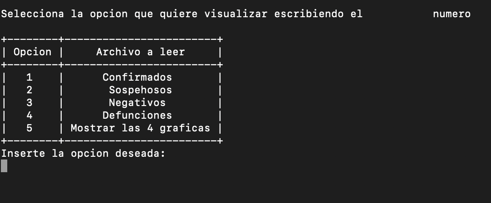
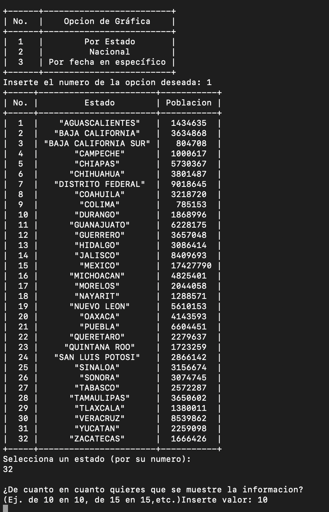
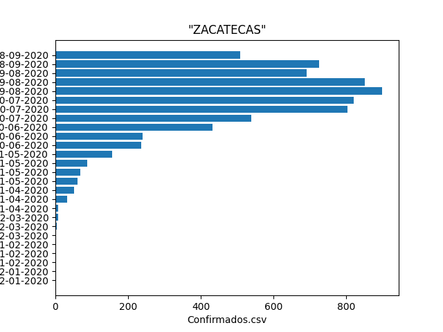

#   Project Covid Data

## Description 

This was a project done for the subject "Computational Thinking for Engineering" where I was asked to make a python program that could display graphs showing the main data from some covid records stored in CSV files. 

## Main Learnings
* Read files from code 
* Process and analyze data
* Manage user inputs
* Pair Programming Technique
* Comment code
* Teamwork

## Installation 

* Make sure to have installed python and pip in your machine
* Download the repository and locate a terminal in the root path of the project
* Run the following commands:
* * <code> pip install prettytable </code>
* * <code> pip install matplolib </code>
* * <code> pip install numpy </code>
* And now you can run the python file whenever you want! 

## Screenshots

   

